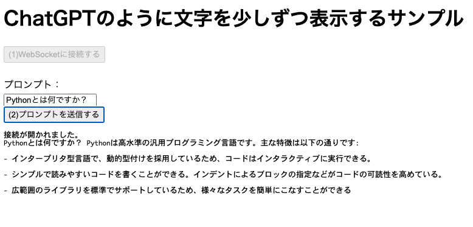

# bedrock_stream_sample

## 概要

ChatGPTのようにCluade2の応答をストリームで受け取るサンプルです。

## 使い方

1. .envファイルを編集します。
2. docker composeを起動します。

   ```sh
   docker compose up -d --build
   ```

3. ブラウザで[http://localhost:8080/](http://localhost:8080/)にアクセスします。
4. 「(1)WebSocketに接続する」ボタンを押して、WebSocketに接続します。
5. プロンプトを入力し、「(2)プロンプトを送信する」ボタンを押します。


